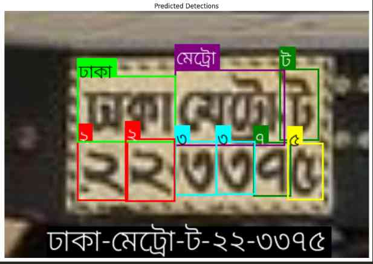
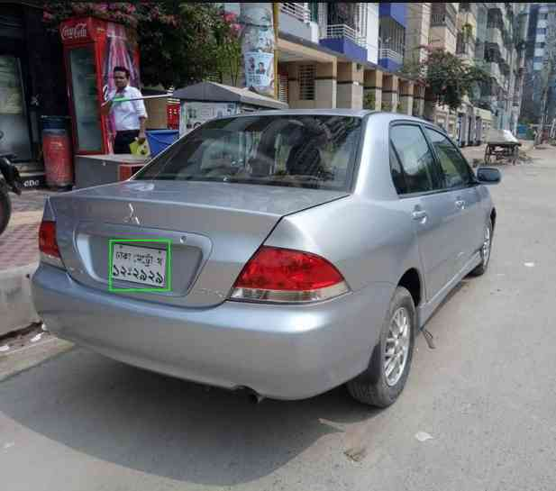

# Bengali License Plate Detection using YOLO

Can detect number plate, and also read its text too! 

YOLO V12 Nano used! (Latest in 2025)

---

## Setup

[Setup Instructions](./setup.md)

---

## Preview

License Plate to Text Detection

&nbsp;

Vehicle to License Plate Detection

---

## The Original Paper

H. H. Shomee and A. Sams, "License Plate Detection and Recognition System for All Types of Bangladeshi Vehicles Using Multi-step Deep Learning Model," 2021 Digital Image Computing: Techniques and Applications (DICTA), Gold Coast, Australia, 2021, pp. 01-07,  https://doi.org/10.1109/DICTA52665.2021.9647284.

---

## Dataset 

[My Modified Dataset Based on Ataher Sams, & Homaira Huda Shomee's (2021) Bangla LPDB - A (Version v1)](https://www.kaggle.com/datasets/arstrxshad/banglabengali-license-plate-with-number-detection)

---

> Modified by
> 
> **Ashikur Rahman Shad**
> 
> [ashikur-rahman-shad (Ashikur Rahman Shad) · GitHub](https://github.com/ashikur-rahman-shad/)
